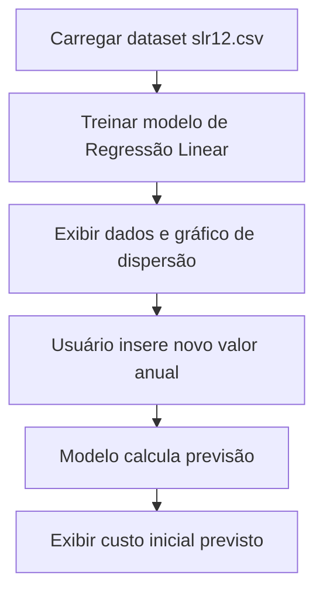
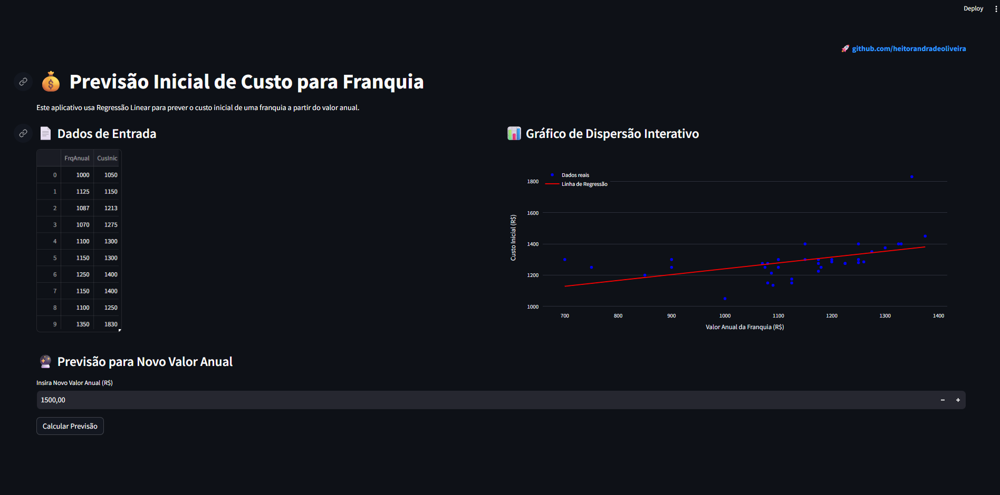

# Previsão de Custo Inicial de Franquia

Este projeto é uma aplicação **interativa em Streamlit** que utiliza **Regressão Linear** para prever o custo inicial de uma franquia a partir do valor anual.

## Funcionalidades

- Exibe os **dados de entrada**.
- Mostra o **gráfico de dispersão** com linha de regressão.
- Permite inserir um novo valor anual e obter a previsão do custo inicial.
- Interface amigável e responsiva.

---

## 🗂 Estrutura do Projeto

```
├── app/
│   ├── slr12.csv # Base de dados
│   └── app.py # Código da aplicação Streamlit
├── assets/
├── LICENSE # Licença MIT
├── README.md # Documentação do projeto
└── requirements.txt # Dependências do projeto

```

---

## 📊 Exemplo de Uso

1. **Carregamento dos dados:**

   - O dataset `slr12.csv` contém as colunas:
     - `FrqAnual` → Valor anual da franquia.
     - `CusInic` → Custo inicial da franquia.

2. **Treinamento:**

   - O modelo de Regressão Linear é treinado com esses dados.

3. **Previsão:**

   - O usuário insere um novo valor anual.
   - O app retorna o custo inicial previsto.

---

## Como Executar Localmente

1. **Clone o repositório**
   ```bash
   git clone https://github.com/seu-usuario/nome-repositorio.git
   cd nome-repositorio
   ```

---

## Configuração do Ambiente Conda para o Projeto

Este guia descreve como configurar corretamente o ambiente Conda para executar o projeto.

### Passo a Passo

Criar o ambiente Conda com Python 3.10

```
conda create -n apps_streamlit python=3.10 pip
conda activate apps_streamlit
```

#### Instalar as dependências

```
pip install -r requirements.txt
```

## Crie um ambiente virtual e instale as dependências sem Conda

```
python -m venv venv
source venv/bin/activate   # Linux/Mac
venv\Scripts\activate      # Windowspip install -r requirements.txt
```

---

## Execute o Streamlit

```
streamlit run ./app/app.py
```

## Acesse no navegador

```
http://localhost:8501
```

---

## Fluxo do App



---

### Captura de Tela da Aplicação

Abaixo está uma captura da interface do aplicativo em execução localmente.
O usuário pode visualizar os dados, o gráfico de dispersão com a linha de regressão e inserir um novo valor anual para obter a previsão do custo inicial da franquia em tempo real.



---

## Acesso ao App Online

Você pode acessar a aplicação da Previsão de Custo de Franquia diretamente no link abaixo, hospedada no Streamlit Cloud:

👉 [franchise-cost-prediction-hao.streamlit.app](https://franchise-cost-prediction-hao.streamlit.app)

---

## Licença

Este projeto está sob a licença MIT - veja o arquivo [LICENSE](./LICENSE) para detalhes.

---

## Contato

LinkedIn: [linkedin.com/in/heitorandradeoliveira](https://linkedin.com/in/heitorandradeoliveira)

---
